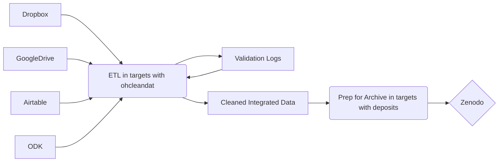
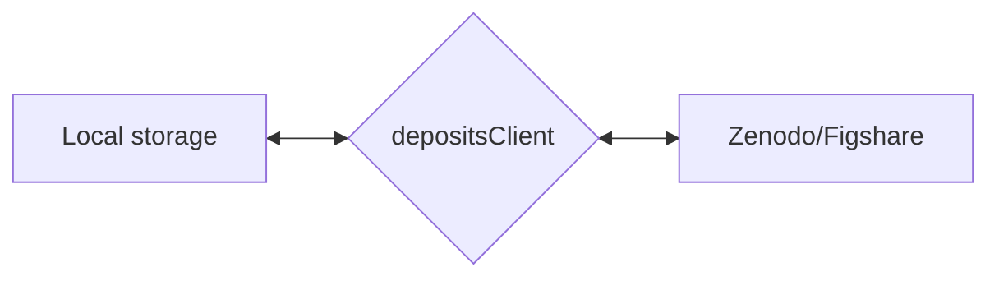

For the better part of a year, I have been looking for an opportunity to use the ROpenSci package [{deposits}](https://docs.ropensci.org/deposits/) in my
role as the Data Librarian at EcoHealth Alliance. I had done some initial testing with the package developer, but there weren't any projects ready for me to put {deposits} through its paces. Enter the `Rift Valley Fever Virus` project, a ten year, multiple part study of humans, wildlife (mosquitos and wild ungulates), and domestic animals that uses every data store from dropbox to google drive to airtable to odk with a healthy mix file formats for tabular data. Whatsmore, the PIs on the project are very enthusaistic about making the data FAIR.  

The team and I put together workflow in [{targets}](https://books.ropensci.org/targets/) with the mechanics of ETL largely handled by our [{ohcleandat}](https://ecohealthalliance.github.io/ohcleandat/) package. The underlaying philosophy of the ETL process is the original data are only lightly modified (stripping white spaces, column names to snake case, etc) while humans do any cleaning that requires thought via validation logs. Changes made in logs are then applied to the data before they are integrated into various larger workpackages. Those workpackages are then deposited into Zenodo to create versioned single sources of truth with digital object identifiers. 

## An abbreviated intro to {deposits} 

The first thing you have to know about {deposits} is that it uses the R6 class. R6 is an object oriented framework where each class of object has a set of methods (functions) that can be applied to it. This is really nice beause you can access all of the available methods of a `depositClient` object by using `cli$SOME_METHOD()` - where its less convenient for people who work in Rstudio is when you're looking for the help page for `SOME_METHOD` - instead you have to look for `depositClient` and scroll to the link to `SOME_METHOD`.

The next kind of tricky thing is [adding api tokens to the environment](https://docs.ropensci.org/deposits/articles/install-setup.html#setup-api-tokens). This can be done in a number of different ways ([encrypted .env file](https://ecohealthalliance.github.io/eha-ma-handbook/16-encryption.html), [usethis::edit_r_environ](https://usethis.r-lib.org/reference/edit.html), etc) but is essential to using this package. Remember that these tokens are sensitive credentials and should not be openly shared.

{deposits} works as an intermediary between a remote service ([Zenodo](https://zenodo.org/) or [Figshare](https://figshare.com/)) and your local machine. Via {deposits} you can create, read, update, or delete items on a remote service.    

{deposits} allows you to prepopulate the metadata for those items. This is incredibly useful if you have to deposit many items with similar metadata, if you have highly collaborative items with dozens of co-authors/contributors, or if you want to update many items with the same bit of metadata.

