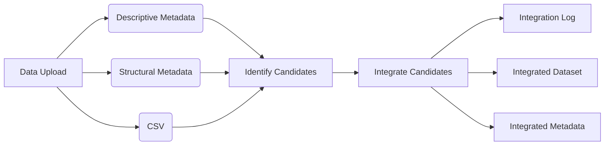
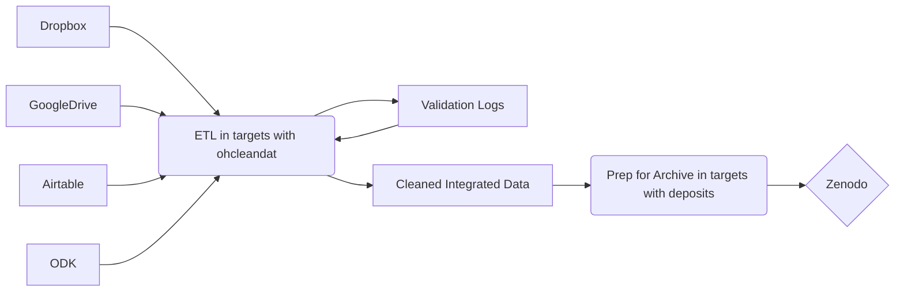

During a recent interview I was asked how I might approach integrating data programatically without ever having seen it. 
Depending on the parameters, this sounds like a wickedly difficult and fun problem so I plan on exploring it further here.

My typical approach to integrating datasets - combining two datasets that contain analogous or identical data elements - involves carefully reviewing metadata and data. This involves comparing data structures, field descriptions, and field properties to ensure the datasets can actually be combined. 

But what happens if the volume of data is too great to review manually?

Ideally, this system would examine incoming data, identify candidates for integration, and attempt to integrate them. Integrated items would then be reviewed for consistency and include a log describing differences between the datasets, and transformations or modifications made to facilitate integration.

### Impose structure on upload
My first instinct is impose rules on data upload that require adherence to a certain data standard. 
Lets say that we will use a general standard like [frictionless tabular data package](https://specs.frictionlessdata.io/data-package/) that provides a minimal framework for metadata and eliminates the need to guess about file structure, file types, and metadata file names. 
Within the frictionless standard, someone can extend the structural and descriptive metadata as they see fit but the structure of the data package will be unchanged. 

In this scenario I can focus on leveraging the structural and descriptive metadata to look for similarities between two datasets - identifying candidates for matching. 
This could involve parsing descriptive metadata looking for matching terms and comparing their values. 
That comparison could involve creating vectorized representations of dataset descriptions and looking for close or exact matches that would suggest further more computationally expensive comparisons should happen. 
The structural metadata would also be extremely useful. 
Datasets with field names that (mostly) match could be candidates for integration, especially if matching field names are reinforced by (mostly) matching field descriptions or better yet exactly matching term IRIs. 

## No data standard imposed on upload, but only certain file types are acceptable

