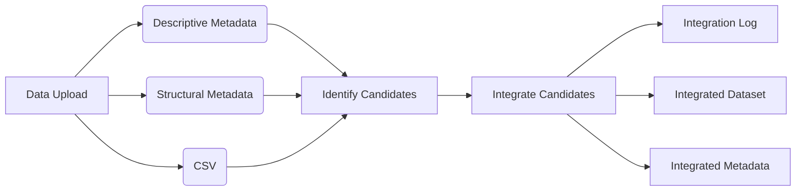
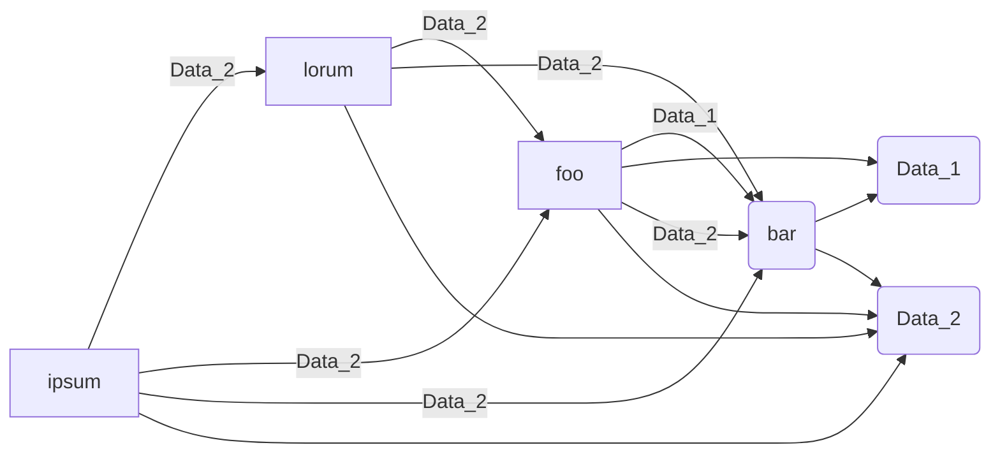

During a recent interview I was asked how I might approach integrating data programatically without ever having seen it. 
Depending on the parameters, this sounds like a wickedly difficult and fun problem so I plan on exploring it further here.

My typical approach to integrating datasets - combining two datasets that contain analogous or identical data elements - involves carefully reviewing metadata and data. This involves comparing data structures, field descriptions, and field properties to ensure the datasets can actually be combined. 

But what happens if the volume of data is too great to review manually?

Ideally, this system would examine incoming data, identify candidates for integration, and attempt to integrate them. Integrated items would then be reviewed for consistency and include a log describing differences between the datasets, and transformations or modifications made to facilitate integration. Data provenance would be key to all these approaches.

### Strict Standards based approach

Anyone submitting data must use a specified data standard and include valid metadata describing their submission. 

Data is lightly processed to ensure that metadata are valid and data align to the metadata. Datasets describing the same phenomena can then be integrated. 

GUID | Local ID| Dataset ID | Age
-----|-------- | -----------| --------
1 | A294 | 1 | 42
2 | foo  | 2 | 42
3 | 0001 | 3 | 42

This method works well if you're an organization that can make these kinds of requirements (think NIH's GenBank or GBIF) but is probably too restrictive for post-hoc data harmonization activities or smaller repos. 

### Generalized standards approach
This approach imposes rules on data upload that require adherence to a general standard like [frictionless tabular data package](https://specs.frictionlessdata.io/data-package/). Frictionless provides a minimal framework for metadata and eliminates the need to guess about file structure, file types, and metadata file names. 
Within the frictionless standard, someone can extend the structural and descriptive metadata as they see fit but the structure of the data package will be unchanged. 

In this scenario I can focus on leveraging the structural and descriptive metadata to look for similarities between two datasets - identifying candidates for matching. 
This could involve parsing descriptive metadata looking for matching terms and comparing their values. 

That comparison could involve creating vectorized representations of dataset descriptions and looking for close or exact matches that would suggest where further more computationally expensive comparisons should happen. 

The structural metadata would also be extremely useful. 
Datasets with field names that (mostly) match could be candidates for integration, especially if matching field names are reinforced by (mostly) matching field descriptions or better yet exactly matching term IRIs. 

Integrated datasets would receive a confidence score 0-1, 1 being extremely confident in the integration. A person would need to confirm that the datasets can be integrated. We could then setup reinforcement learning to improve model performance. 

## Relax the structure

What if certain elements of data can be consistently harmonized across datasets, but the entire
datasets themselves can't be integrated? 

Data submitted in tabular, tree, or other structures could be unspooled and integrated at the individual property level using one of the matching algorithms described above. 
If we capture data relationships in a graph we have something that is pretty exciting.
Not only can we create a large dataset for a particular attribute, but we can then query the graph of relationships and figure out what other attributes can be added to the data. 

